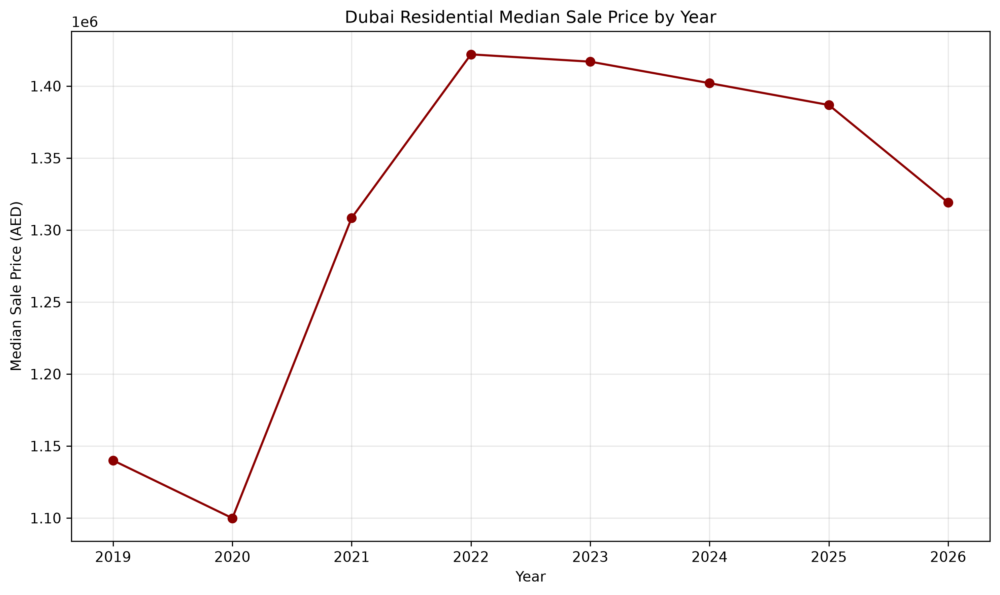
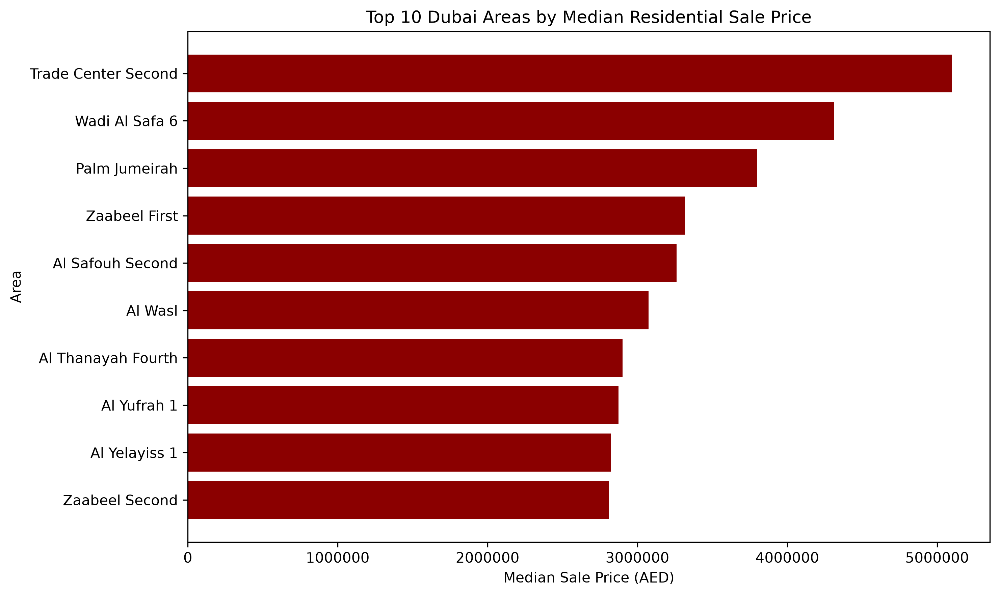
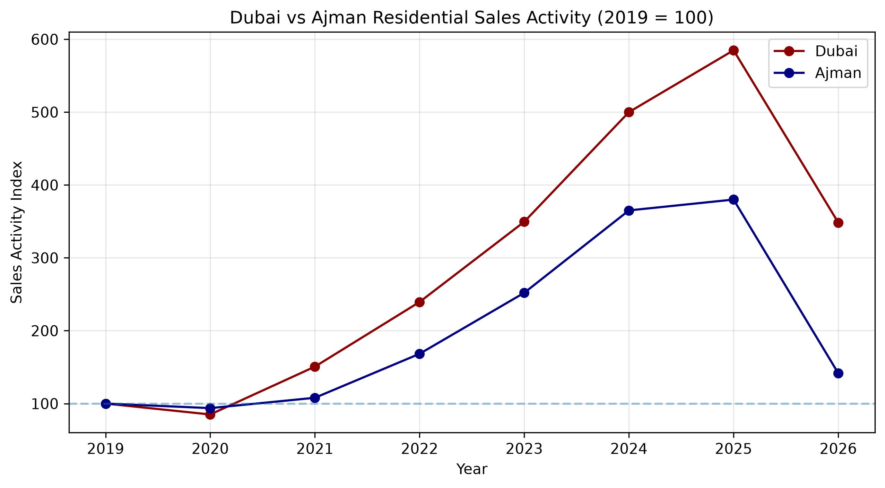
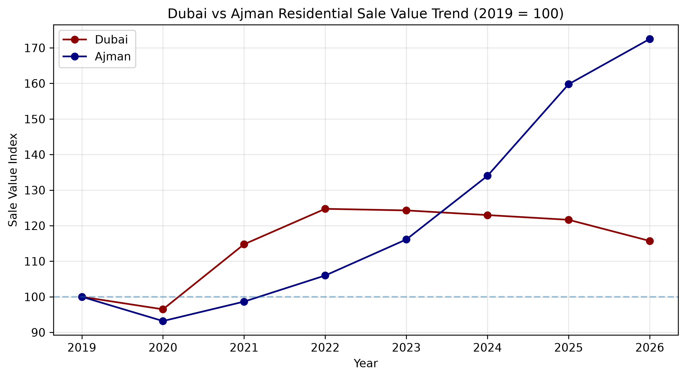
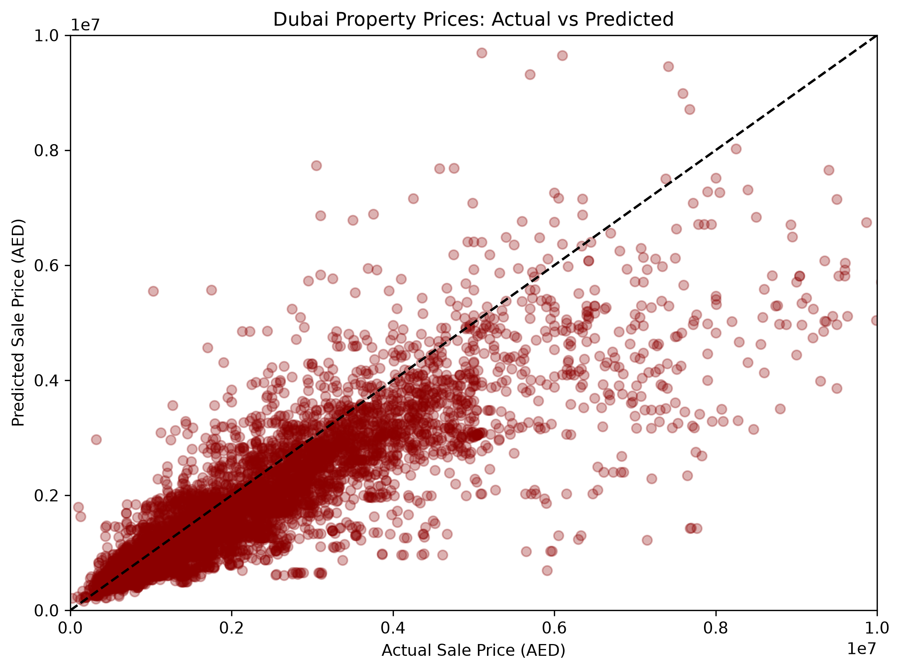

# UAE Real Estate Analytics & Price Prediction 🏙️

An end-to-end real estate analytics and machine learning project built with public Dubai and Ajman property data.

The project analyzes market trends across the two emirates and develops a machine learning model for estimating Dubai residential property values.

### [View Live Property Valuation App](https://ameerasaeedhassan-uae-property-price-prediction-app-thb1hl.streamlit.app/)

---

## Project Overview

**898K+** Dubai property records were processed to study the UAE real estate market and build a residential property valuation model.

After filtering and data quality checks, **550K+ residential Unit and Villa sales** were used for analysis and model development.

The project covers:

- Dubai residential market analysis
- Dubai and Ajman market comparison from 2019–2026
- Location and property-type analysis
- Residential price modelling
- Model evaluation and error analysis
- Interactive property valuation web application

Mortgages, gifts, commercial properties, land, and other non-residential transactions were excluded from the modelling dataset.

---

## Market Analysis

### Dubai Residential Price Trend

Dubai residential median sale prices increased strongly after 2020, with noticeable changes in market activity and property values over the following years.



### Highest-Priced Dubai Areas

Residential prices vary significantly by location. The analysis compares median sale prices across Dubai areas with sufficient transaction activity.



### Dubai vs Ajman — Sales Activity

Dubai and Ajman datasets have different structures, so sales activity was normalized using **2019 = 100** to make the market movements comparable.



### Dubai vs Ajman — Property Values

The normalized value index shows how property values in both emirates changed relative to their 2019 levels.



---

## Property Price Model

The Dubai valuation model uses seven property and transaction characteristics:

`Location` · `Property Type` · `Bedrooms` · `Size` · `Parking` · `Year` · `Quarter`

Three regression approaches were tested:

| Model | MAE (AED) | R² |
|---|---:|---:|
| Linear Regression | 711,818 | **0.644** |
| HistGradientBoosting | 579,150 | 0.409 |
| **Log-HistGradientBoosting** | **562,645** | 0.407 |

**Log-HistGradientBoosting** produced the lowest overall Mean Absolute Error at approximately **AED 563K**.

Linear Regression achieved the highest R², showing that model selection depends on the evaluation metric and intended use.

### Actual vs Predicted Prices

The model performs more consistently for lower and mid-priced properties. Prediction errors increase in the luxury segment, where transaction values are more variable.



---

## Interactive Valuation App

The trained model is deployed as an interactive Streamlit application.

Users can enter:

- Dubai location
- Property type
- Number of bedrooms
- Property size
- Parking availability

The application returns an estimated residential property value based on patterns learned from historical Dubai transactions.

### [Launch Dubai Property Valuation App](https://ameerasaeedhassan-uae-property-price-prediction-app-thb1hl.streamlit.app/)

---
## Tech Stack
Python · Pandas · NumPy · Matplotlib · scikit-learn · Streamlit · Jupyter · Git/GitHub

---

## Data Sources

This project uses publicly available UAE government real estate data.

- **Dubai Real Estate Transactions** — Dubai Land Department (DLD), Data Dubai  
  [View Official Dataset](https://data.dubai/en/l/470061?com_dda_data_and_statistics_ThemeId=3282906)

- **Ajman Real Estate Units Sales** — Department of Land and Real Estate Regulation, Ajman Data  
  [View Official Dataset](https://data.ajman.ae/explore/assets/real-estate-units-sales/)

The Dubai dataset contains transaction-level real estate records, while the Ajman dataset contains aggregated property sales records.

Raw datasets are not included in this repository due to file size. All data is credited to the respective UAE government data providers.

---

## Project Structure

```text
UAE-Property-Price-Prediction/
│
├── app.py
├── requirements.txt
│
├── models/
│   └── dubai_property_model.joblib
│
├── notebooks/
│   ├── 03_dubai_cleaning.ipynb
│   ├── 04_ajman_cleaning.ipynb
│   ├── 05_exploratory_analysis.ipynb
│   └── 06_dubai_price_model.ipynb
│
├── images/
│   ├── dubai_price_trend.png
│   ├── dubai_top_areas.png
│   ├── dubai_ajman_activity.png
│   ├── dubai_ajman_value.png
│   └── actual_vs_predicted.png
│
└── README.md

Note
The valuation model is intended as a data science project and analytical estimate, not a professional property appraisal.
2026 data represents a partial year and should be interpreted accordingly.